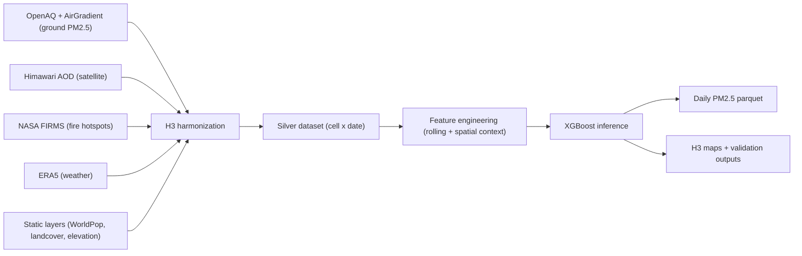

# 🌏 Air for Tomorrow

[](https://github.com/unicef/airfortomorrow/actions/workflows/tests.yml)
[](LICENSE)
[](https://github.com/unicef/airfortomorrow/releases)


**An open source AI toolkit for nearcasting PM2.5 air pollution at sub-1km resolution, with a pretrained model for Laos and Thailand.**

Developed by UNICEF EAPRO's Frontier Data Lab, with support from UNICEF Office of Innovation and Arm

## 📑 **Table of Contents**

- [How It Works (In a Nutshell)](#how-it-works-in-a-nutshell)
- [Quick Start](#quick-start)
- [Release Notes](#release-notes)
- [Contributing & Support](#contributing--support)
- [External Datasets and Licenses](#external-datasets-and-licenses)
- [Project Structure](#project-structure)
- [Key Features](#key-features)
- [Performance Metrics](#performance-metrics)
- [Intended Use and Limitations](#intended-use-and-limitations)
- [Pipeline Workflows](#pipeline-workflows)
- [Model Information](#model-information)
- [Docker Information](#docker-information)

## 🎯 **How It Works (In a Nutshell)**

Air for Tomorrow predicts PM2.5 by taking 18 separate geospatial data sources at varying resolutions, harmonising them into a single daily, [H3](https://h3geo.org/) feature table, then training an [XGBoost](https://xgboost.readthedocs.io/) model on that data to nearcast daily PM2.5 for all of Thailand and Laos.

### **Architecture Overview**


### **1) Build a wall-to-wall H3 base frame**
- The pipeline creates all **H3 resolution 8** cells (~0.74 km² each) inside the selected countries ([resolution reference](https://h3geo.org/docs/core-library/restable)).
- It cross-joins those cells with the date range, creating one row per `cell x day`.
- This ensures coverage even where no ground sensor exists.

### **2) Ingest each source and convert to H3**
- **Ground PM2.5 (OpenAQ + AirGradient):** collected, quality-filtered, deduplicated, then mapped to H3 cells.
- **Himawari AOD:** NetCDF -> GeoTIFF -> H3 -> daily aggregates.
- **FIRMS fire points:** deduplicated and transformed with KDE into continuous fire intensity on H3.
- **ERA5 weather:** interpolated to H3 daily variables (`temperature_2m`, `dewpoint_2m`, `wind_u_10m`, `wind_v_10m`).
- **Static context:** high-resolution WorldPop (100m source), landcover, and elevation are joined by H3 cell.

### **3) Fill gaps and reconcile mismatched resolutions**
- **[IDW interpolation](https://en.wikipedia.org/wiki/Inverse_distance_weighting)** fills cloud-related missing AOD and densifies weather coverage.
- **[KDE](https://en.wikipedia.org/wiki/Kernel_density_estimation)** turns sparse hotspot points into smoother exposure fields.
- Everything is aligned to the same H3+date keys before modeling.

### **4) Engineer predictive features**
- The [silver step](src/make_silver.py) adds a **7-day buffer** so rolling features are valid from day one.
- It computes 3-day and 7-day rolling means for AOD, fire, and weather signals.
- It adds a spatial-context feature: **`yesterday_parent_h3_04_pm25`**.
  This is a deliberate cross-resolution trick: aggregate PM2.5 at coarser H3-04, then lag by one day to provide broader context where sensors are sparse.

### **5) Predict PM2.5 for every H3 cell**
- The model consumes **21 engineered features** and predicts PM2.5 (log-space output converted back to μg/m³) in [prediction code](src/predict_air_quality.py).
- Outputs are daily parquet files plus optional map/validation artifacts.

### **What is technically interesting here**
- **H3-native pipeline end-to-end:** ingestion, feature engineering, model inference, and map rendering all use a shared hex grid language.
- **Cross-resolution 'sensor fusion' feature design:** coarse H3 context + fine H3 prediction improves coverage and stability. Combines both reference and low cost sensors to improve model accuracy.
- **Sensor-sparse inference:** Air for Tomorrow estimates PM2.5 in places without monitors by learning from satellite, weather, fire, static context, and nearby temporal/spatial signals.

## 🚀 **Quick Start**

### **Prerequisites**
- Docker (allocate at least 16 GB memory to the runtime)
- Git LFS installed
- API credentials for:
  - Himawari FTP: register at https://www.eorc.jaxa.jp/ptree/registration_top.html (credentials are sent by email).
  - Copernicus CDS: create an account and follow https://cds.climate.copernicus.eu/how-to-api to generate API credentials.
  - OpenAQ: sign up and get your API key from Profile Settings (quick start: https://docs.openaq.org/using-the-api/quick-start).

### 1. **Clone the repository**
```bash
git clone https://github.com/unicef/airfortomorrow.git
cd airfortomorrow
git lfs install
git lfs pull
```

### 2. **Configure credentials**
```bash
cp env_template .env
# Edit .env and add your API credentials
```

### 3. **Build and run the Docker container**
```bash
docker build -t airquality-app .

docker run --rm -it --memory=16g \
  -v "$(pwd)/data:/app/data" \
  -v "$(pwd)/assets:/app/assets" \
  -v "$(pwd)/scripts:/app/scripts" \
  -v "$(pwd)/config:/app/config" \
  -v "$(pwd)/src:/app/src" \
  -v "$(pwd)/.env:/app/.env" \
  -e LOCAL_DEV=1 \
  airquality-app
```

### 4. **Inside the container shell, run your first prediction**
```bash
./scripts/setup.sh
./scripts/run_complete_pipeline.sh --mode realtime --countries THA LAO --generate-maps --parallel
```

Typical first run takes about 20-40 minutes depending on network and compute.

### 5. **Verify expected outputs**
- Silver features: `data/silver/realtime/`
- Predictions parquet: `data/predictions/data/realtime/aq_predictions_YYYYMMDD_LAO_THA.parquet`
- Prediction maps (when `--generate-maps` is enabled): `data/predictions/map/realtime/aqi_map_YYYYMMDD_LAO_THA.png`
- Pipeline log: `logs/complete_pipeline_YYYYMMDD_HHMMSS.log`

---

## 📝 **Release Notes**

- **[CHANGELOG](CHANGELOG.md):** User-facing changes by version (`Unreleased` + released versions)
- **[RELEASING](RELEASING.md):** Maintainer workflow for updating release notes and publishing tags/releases

## 🤝 **Contributing & Support**

- **Contributing:** [CONTRIBUTING.md](CONTRIBUTING.md) for development workflow and contribution expectations
- **Code of Conduct:** [CODE_OF_CONDUCT.md](CODE_OF_CONDUCT.md) for community participation standards
- **Support:** [SUPPORT.md](SUPPORT.md) for usage-question and bug-report routing
- **Security:** [SECURITY.md](SECURITY.md) for private vulnerability reporting (do not report vulnerabilities publicly)

## ⚖️ **External Datasets and Licenses**

Canonical inventory (source URLs, license/terms URLs, and attribution constraints):  
**[External Datasets and Licenses](EXTERNAL_DATASETS_AND_LICENSES.md)**

---

## 📁 **Project Structure**

```
airfortomorrow/
├── src/                        # Python source code
│   ├── data_collectors/        # Data collection modules
│   ├── data_processors/        # Data processing modules
│   ├── models/                 # Pre-trained XGBoost model
│   └── utils/                  # Utility modules
├── scripts/                    # Shell scripts for all workflows
├── data/                       # All data (volume mounted, created on first run)
│   ├── raw/                    # Raw collected data
│   ├── processed/              # Processed outputs
│   ├── silver/                 # Unified ML-ready datasets
│   └── predictions/            # Predictions, maps, and validation
├── assets/                     # Static datasets (volume mounted)
├── config/                     # Configuration files
├── notebooks/                  # Jupyter notebooks
├── viz_examples/               # Example visualization outputs
├── Dockerfile                  # Docker configuration
├── requirements.txt            # Python dependencies
├── env_template                # Environment variables template
├── CHANGELOG.md                # Versioned release notes
├── RELEASING.md                # Lightweight maintainer release process
└── README.md                   # This file
```

**Key directories:**
- **`src/`**: Python modules for data collection, processing, and prediction
- **`scripts/`**: Shell scripts wrapping Python modules for easy execution
- **`data/`**: All pipeline outputs (automatically created and organized by mode)
- **`assets/`**: Static datasets (population, landcover, sensor lists)
- **`config/`**: Configuration files for the system

📚 **[See Detailed Project Structure](DOCUMENTATION.md#project-structure)**

---

## 🌟 **Key Features**

### **🔧 Operational Pipeline Features**
- ✅ **Complete automation** from data collection to predictions
- ✅ **Real-time and historical** processing modes
- ✅ **Comprehensive logging** and progress tracking
- ✅ **Space-efficient storage** with automatic cleanup

### **🔗 Advanced Data Integration**
- ✅ **Multi-source fusion**: Satellite AOD, fire, weather, ground sensors
- ✅ **Fallback handling**: The pipeline can continue when some data sources are unavailable

### **🗺️ Enhanced Visualization**
- ✅ **AQI maps** with H3 hexagonal visualization
- ✅ **Color-coded air quality** categories with WHO guidelines
- ✅ **Deviations measures** versus ground measurements: scatter plots and maps

### **💾 Storage Management**
- **Automatic Cleanup**: AOD NetCDF files deleted after H3 processing (configurable)
- **Cache-Based Processing**: AOD Temporary TIF files in cache, auto-deleted
- **Existing-output checks**: The pipeline skips files that are already present
- **Mode-Based Organization**: `/realtime/` and `/historical/` subdirectories

### **📦 Git LFS For Large Data**
- `data/training/silver_dataset.parquet` is stored via Git LFS.
- Required bootstrap datasets under `assets/` and `data/raw/firms/historical/` are also tracked via Git LFS.
- After cloning, run:
  ```bash
  git lfs install
  git lfs pull
  ```

---

## 📈 **Performance Metrics**

### **🌍 Coverage**
- **Spatial**: H3 resolution 8 (~0.74 km² hexagons)
- **Temporal**: For real-time mode, predicts the next 24-hour PM2.5 concentration. For historical mode, predicts the next-day concentration.
- **Countries**: Thailand (THA) and Laos (LAO)

### **🧪 Model Evaluation (Hold-Out)**
- **Source:** `MODELCARD.MD` evaluation section (rerun on March 6, 2026)
- **Model artifact:** `src/models/xgboost_model.json`
- **Evaluation dataset:** `data/training/silver_dataset.parquet`
- **Train window:** 2021-12-31 to 2024-12-31
- **Hold-out window:** 2025-01-01 to 2025-10-30 (`n=93,572`, after `pm25_value < 250` filter)

| Segment | MAE (µg/m³) | RMSE (µg/m³) | R² | Correlation | Mean Bias (µg/m³) |
|---------|-------------|--------------|----|-------------|-------------------|
| Overall | 9.59 | 16.16 | 0.638 | 0.805 | -0.10 |
| Thailand (THA) | 8.46 | 14.06 | 0.669 | 0.824 | 0.47 |
| Laos (LAO) | 13.06 | 21.37 | 0.586 | 0.773 | -1.86 |

---

## ⚠️ **Intended Use and Limitations**

Use this toolkit for regional PM2.5 situational awareness, public-health planning support, and retrospective analysis.

Treat outputs as model-based estimates, not diagnostic or regulatory truth. For high-stakes decisions, combine predictions with local monitoring and official advisories.

For full guidance, see **[MODELCARD.MD](MODELCARD.MD)** (Uses, Out-of-Scope Use, and Bias/Risks/Limitations sections).

---

## 🔄 **Pipeline Workflows**

Use the complete pipeline for most runs, and refer to the technical docs for source-specific workflows and advanced flags.

```bash
# Real-time (recommended for daily operations)
./scripts/run_complete_pipeline.sh --mode realtime --countries THA LAO --generate-maps --parallel

# Historical analysis
./scripts/run_complete_pipeline.sh --mode historical --start-date 2024-06-01 --end-date 2024-06-03 --countries THA LAO --generate-maps
```

Detailed workflow documentation:
- **[Complete Pipeline Workflow](DOCUMENTATION.md#complete-pipeline-workflow)**
- **[Air Quality (OpenAQ + AirGradient)](DOCUMENTATION.md#1-air-quality-data)**
- **[FIRMS Fire Detection](DOCUMENTATION.md#2-firms-fire-detection-data)**
- **[Historical Data Availability](DOCUMENTATION.md#historical-data-availability)**
- **[Himawari Satellite AOD](DOCUMENTATION.md#3-himawari-satellite-aod-data)**
- **[ERA5 Meteorological Data](DOCUMENTATION.md#4-era5-meteorological-data)**
- **[Silver Dataset Generation](DOCUMENTATION.md#5-silver-dataset-generation)**
- **[Air for Tomorrow](DOCUMENTATION.md#6-air-for-tomorrow)**

---

## 🤖 **Model Information**

### **XGBoost Prediction System**

Air for Tomorrow uses machine learning to predict PM2.5 concentrations based on the silver datasets with optional high-quality map visualizations.

### **Model Input Features**

| Feature | Source | Timespan | Column | Description |
|---------|--------|---------------|---------------|-------------|
| **month** | Date dimension | monthly| `month` | Month of year (1-12) |
| **daily_mean_aod_kriged** | Himawari | 1 day, 3 days and 7 days average |`aod_1day_interpolated / aod_1day_interpolated_roll3 / aod_1day_interpolated_roll7` | Satellite aerosol optical depth (IDW interpolated) |
| **fire_hotspot_strength** | FIRMS | 1 day, 3 days and 7 days average | `fire_hotspot_strength / fire_hotspot_strength_roll3 / fire_hotspot_strength_roll7` | Fire intensity (KDE density) |
| **2t** | ERA5 | 1 day, 3 days and 7 days average  | `temperature_2m / temperature_2m_roll3 / temperature_2m_roll7 ` | 2-meter temperature (°C) |
| **10u** | ERA5 | 1 day, 3 days and 7 days average  |`wind_u_10m / wind_u_10m_roll3 / wind_u_10m_roll7` | 10-meter u-wind component (m/s) |
| **10v** | ERA5 |1 day, 3 days and 7 days average  | `wind_v_10m / wind_v_10m_roll3 /wind_v_10m_roll7` | 10-meter v-wind component (m/s) |
| **2d** | ERA5 | 1 day, 3 days and 7 days average  |`dewpoint_2m / dewpoint_2m_roll3 /dewpoint_2m_roll7` | 2-meter dewpoint temperature (°C) |
| **elevation** | NASA SRTM | Static |`elevation` | Terrain elevation |
| **worldpop_population** | WorldPop | 2025 average  |`worldpop_population` | Population density |
| **Spatial AQ context** | OpenAQ and AirGradient  | previous day  |`yesterday_parent_h3_04_pm25` | Previous-day PM2.5 average from the parent H3-04 cell (coarser resolution) |

**Details on enhanced features:**
- **Rolling Averages**: The model uses 3-day and 7-day rolling averages for all time-series features (AOD, fire intensity, temperature, wind, dewpoint), capturing temporal trends
- **Spatial Context**: The model includes a previous-day air quality context feature. Because direct measures are only available where sensors exist, using hexagonal H3 resolution 8 for previous-day PM2.5 would leave many gaps. To reduce this issue, we use a coarser resolution and calculate the previous-day average PM2.5 concentration on an H3 resolution 4 cell (~1,770 km²), versus resolution 8 (~0.74 km²) for prediction. This provides broader previous-day PM2.5 coverage across most of each country.


📚 **[Complete Model Features (21 total)](DOCUMENTATION.md#model-features-21-total)**

### **Air Quality Categories**

The system uses WHO air quality guidelines for map visualization:

| Category | PM2.5 Range (μg/m³) | Color | Description |
|----------|---------------------|-------|-------------|
| Good | 0 - 15 | 🟢 #a8e05f | Satisfactory air quality |
| Moderate | 15 - 35 | 🟡 #fdd64b | Acceptable for most people |
| Unhealthy for Sensitive Groups | 35 - 55 | 🟠 #ff9b57 | Sensitive individuals may experience problems |
| Unhealthy | 55 - 150 | 🔴 #fe6a69 | Everyone may experience health effects |
| Very Unhealthy | 150+ | 🟣 #a97abc | Health warnings for entire population |

---

## 🐳 **Docker Information**

### **Container Features**
- ✅ **Pre-configured Environment**: All system dependencies installed
- ✅ **Automatic Setup**: Runs setup.sh on container start (validates required local bootstrap files)
- ✅ **Interactive Shell**: Available commands displayed on startup
- ✅ **Data Persistence**: Volume mounts preserve all outputs
- ✅ **Environment Variables**: Loaded from .env file

### **System Dependencies**
The Docker container includes all required system dependencies:
- **GDAL**: Geospatial data processing
- **ecCodes**: Meteorological data handling
- **OpenMP**: Runtime library for XGBoost
- **jq**: JSON processor for configuration parsing
- **yq**: YAML processor for reading configuration files

### **Container Entrypoint**
The container starts with an interactive menu showing available commands:
- Individual data source pipelines
- Data cleaning and silver dataset generation
- Air quality prediction with maps
- Complete end-to-end pipeline execution

---
